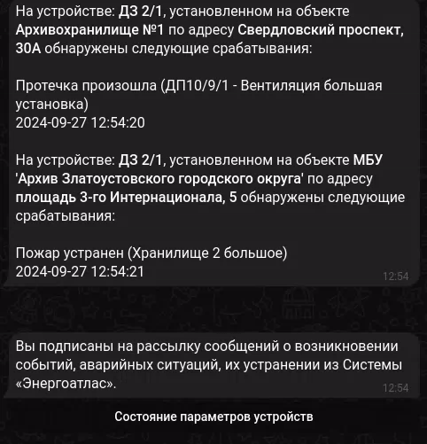

# Telegram бот с интеграцией к системе «Энергоатлас»
Предназначен для информирования подписанных пользователей о срабатывании аварийных критериев датчиков (пожара, задымленности, подтопления). Позволяет просматривать текущие показатели параметров датчиков от лица зарегистрированного в системе пользователя.

* ✅ **Aiogram** – полностью асинхронная архитектура
* ✅ **Aioshedule** – планирование задач для _человека-разумного_
* ✅ **sqlalchemy[asyncio]** – ORM
* ✅ **httpx** – http-клиент

### Описание работы
Через бота пользователь проходит авторизацию используя свои учетные данные от системы «Энергоатлас». При успешной авторизации, бот подписывает пользователя на получение уведомлений и даёт возможность просматривать показатели датчиков.

#### Уведомления о срабатывании аварийных критериев датчиков
Каждую минуту рабочий процесс опрашивает API «Энергоатлас», от лица пользователя с полным доступом к системе, на наличие срабатывания аварийных критериев по каждому из устройств, за которыми осуществляется наблюдение. По новым срабатываниям пользователям, к ведению которых относятся устройства, отправляются уведомительные сообщения, после чего информация о срабатывании критерия записывается в базу данных.

#### Просмотр показателей датчиков от лица авторизованного в системе пользователя
Через навигационное меню пользователь выбирает организацию, объект и устройства. Список доступных для пользователя сущностей приходит в ответе на запрос к API системы, осуществленный от лица пользователя, предварительно прошедшего авторизацию. После выбора устройства отображаются параметры

### Демо
Потыкаться и посмотреть бота можно [по ссылке](https://t.me/local_energoatlas_bot), используя учетные данные `admin@example.com`:`Jb21uHa73omYia`. 

Демонстрационный бот подключается к эмулятору-API «Энергоатлас» и предоставляет одинаковые (статические) данные по параметрам всех устройств. Каждую минуту эмулятор, в ответе на запрос аварийных событий, генерирует два события со случайным наименованием